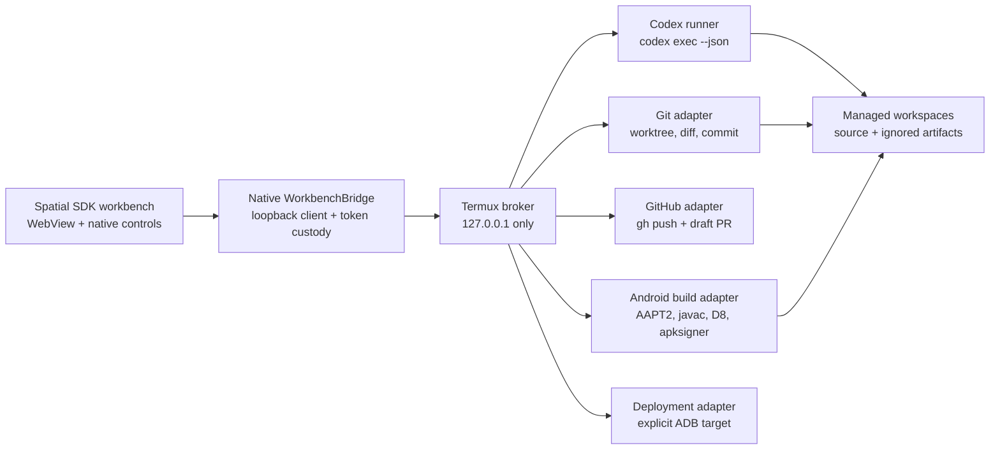

# Spatial Codex Workbench proof-of-concept implementation plan

Status: implemented and live-validated proof of concept, including GitHub pull/push
Target: public, source-first proof of concept in this repository
Example root: `examples/spatial-codex-workbench/`

## 1. Decision

Build a Quest-native Spatial SDK workbench around a headless Termux service.
The workbench will demonstrate one complete, operator-visible path:

> Create or clone a repository, ask Codex to make a bounded change, review the
> Git diff, build and version an APK locally on Quest, commit the change,
> optionally push it and open a draft pull request, then explicitly install and
> launch the selected APK through an authorized loopback ADB shell lease.

Version `0.1` will use `codex exec --json` behind an `AgentRunner` interface.
It will support one active Codex turn and one active build at a time. The first
release will not implement the full Codex app-server protocol. This keeps the
proof small while preserving a migration path to persisted conversations,
interactive approvals, and richer client behavior later.

The Linux desktop, Termux:X11, VNC, and the existing spatial desktop panel are
reference and fallback lanes only. They are not dependencies of the primary
workbench workflow.

## 2. Proven baseline

This plan starts from capabilities already demonstrated in the repository:

- Codex CLI can run in Quest Termux/Proot, edit a Git checkout, and execute
  repository validation. See
  [`on-device-codex-rusty-xr-workflow.md`](on-device-codex-rusty-xr-workflow.md).
- Git, Node, and Codex availability plus a reviewed repository patch are
  represented by the public-safe
  [`codex-xr-workflow-evidence.synthetic.json`](../examples/codex-xr-workflow-evidence.synthetic.json).
- Java, AAPT2, D8, zipalign, apksigner, Git, and ADB have been exercised on
  Quest in the source-only APK loop. See
  [`on-device-apk-build-install-launch.md`](on-device-apk-build-install-launch.md)
  and
  [`codex-xr-workflow-evidence.on-device-apk.synthetic.json`](../examples/codex-xr-workflow-evidence.on-device-apk.synthetic.json).
- A Spatial SDK panel with layer rendering, grabbing, resize, recenter,
  keyboard handling, loopback networking, and lifecycle recovery already
  exists at [`spatial-desktop-panel`](../examples/spatial-desktop-panel/README.md).

The integrated product surface is now implemented: a Quest GUI, typed local
broker, bounded Codex/Git/GitHub adapters, versioned artifact records, recovery
behavior, and a sanitized end-to-end demonstration. The local Codex, Git,
build, install, launch, and recovery path has been live-validated. A separate
public showcase also live-validated GitHub fast-forward pull, on-Quest build
and deployment of the pulled source, Codex editing and version commit on Quest,
feature-branch push, and draft-pull-request creation.

### 2.1 Implementation outcome

The live proof completed capability preflight, created an isolated run branch,
used a ChatGPT-subscription-authenticated Codex CLI to edit source, presented
the Git diff, bumped the demo version, committed the change, built and verified
a candidate APK, gated an exact ADB shell target, installed and launched the
candidate, read back its installed version, found no bounded package fatal, and
reconnected the workbench to the same clean run after the candidate took
focus. The installed candidate reported version code `2` and version name
`0.1.1`.

The GitHub round-trip proof then pulled remotely updated source into a clean
Quest checkout, built and deployed version `1.0.0`, used Codex CLI on the Quest
to create the reviewed `1.0.1` change, pushed the feature branch, opened a
draft pull request, and installed and launched the candidate with matching
version readback and no bounded package fatal.

The sanitized acceptance record is
[`../examples/spatial-codex-workbench/fixtures/acceptance-summary.synthetic.json`](../examples/spatial-codex-workbench/fixtures/acceptance-summary.synthetic.json).
The GitHub round-trip record is
[`../examples/spatial-codex-workbench/fixtures/github-round-trip-acceptance.synthetic.json`](../examples/spatial-codex-workbench/fixtures/github-round-trip-acceptance.synthetic.json).

## 3. Product goal and success claim

The public proof should support this precise claim:

> A user can perform a bounded agentic Android development loop entirely on a
> Meta Quest: Codex edits a Git-backed source project in Termux, the user
> reviews the diff, the Quest compiles and signs an APK, Git records the source
> version, GitHub can receive a branch and draft pull request when separately
> authenticated, and an explicitly authorized ADB shell lease can install and
> launch the selected artifact on the headset.

The proof must not claim unattended deployment, ADB authorization bypass,
root, device-owner behavior, general Android development compatibility, full
IDE parity, durable reboot recovery, or production-grade credential custody.

## 4. Scope

### 4.1 Required for version 0.1

- One movable, resizable Spatial SDK panel.
- A bundled HTML/CSS/TypeScript interface rendered in an Android WebView.
- A Termux-owned loopback service with a typed, versioned API.
- A fixed workspace root and a reproducible source-only Android demo project.
- Create-demo-workspace and clone-supported-repository flows.
- One `codex exec --json` run at a time, with streaming, cancellation, timeout,
  final status, and resume metadata.
- Current branch, clean/dirty status, changed-file list, bounded unified diff,
  and current commit.
- A run-owned feature branch and isolated worktree for cloned repositories.
- Preview build from reviewed uncommitted changes.
- Candidate build from a clean commit.
- Explicit `versionCode` and `versionName` management.
- APK hash, package/activity, source revision, build type, and signing
  fingerprint readback.
- Commit with a user-supplied message.
- Optional push and draft pull request through an already authenticated
  GitHub CLI.
- Explicit ADB target discovery, shell-UID gate, install, launch, and bounded
  launch verification.
- Recovery after the Spatial app is backgrounded by the launched demo APK.
- Synthetic tests and public-safe evidence fixtures.
- Browser-hosted UI development without a headset.

### 4.2 Deliberate non-scope

- A general terminal, arbitrary shell endpoint, or arbitrary command builder.
- A source editor or full filesystem browser.
- Linux desktop streaming in the primary workflow.
- Multiple simultaneous Codex runs, builds, repositories, or devices.
- Full Codex conversation/history management.
- Direct use of the experimental Codex app-server WebSocket transport.
- Merge, rebase, cherry-pick, or conflict-resolution UI.
- Force-push, branch deletion, release publication, or pull-request merge.
- GitHub issue dashboards, review administration, or CI log exploration.
- A formal GitHub App, OAuth callback service, or embedded GitHub credentials.
- Automatic ADB pairing, authorization, Wireless Debugging recovery, or
  reboot persistence.
- Uninstall, clear-data, device settings, keep-awake policy changes, or package
  cleanup outside the selected public demo package.
- Production signing or release keystore management.
- General Gradle, Unity, Unreal, Makepad, Rust/OpenXR, or Spatial SDK project
  compatibility. Version 0.1 proves the included source-only Android template.

## 5. Architecture



### 5.1 Spatial workbench APK

Create a new sibling example rather than adding Codex or GitHub behavior to
`spatial-desktop-panel`. Reuse only its proven public presentation patterns:

- `AppSystemActivity`, `VRFeature`, XML panel registration, and layer mode;
- viewer-relative initial placement;
- `Grabbable(PIVOT_Y)` with one transform owner;
- bounded physical scaling and debug-only recenter;
- Quest keyboard/IME lifecycle handling;
- fixed Termux `RUN_COMMAND` dispatch with typed arguments and result return.

The APK owns presentation, input, connection state, user confirmations, and
projection of structured results. It does not own Git, Codex, builds, GitHub,
or ADB execution.

The WebView loads only bundled assets through a trusted app asset origin.
External navigation, file URLs, arbitrary JavaScript injection, and mixed
content remain disabled. A narrow native `WorkbenchBridge` validates UI
requests, talks to the broker over loopback, and sends redacted events back to
the WebView. The WebView never receives the broker bearer token, Codex
credentials, GitHub credentials, keystore paths, or raw process environments.

Native controls remain responsible for the highest-risk actions:

- cancel active Codex run;
- discard run-owned uncommitted changes;
- commit;
- push and create draft pull request;
- choose ADB target;
- install;
- launch.

### 5.2 Termux broker

Implement a small Node.js service bound only to `127.0.0.1` on one fixed,
documented port. The broker is the sole owner of process execution and
workspace paths. It must:

- authenticate every request with an ephemeral high-entropy token;
- validate the API version and request schema;
- enforce one active Codex run and one active build/deploy mutation;
- resolve and re-check every path under the managed workspace root;
- reject symlink or real-path escape;
- use fixed executable paths or a startup-resolved tool registry;
- invoke subprocesses without a shell and with explicit argument arrays;
- apply time, output, event, and file-size bounds;
- redact credential-shaped output before persistence or UI projection;
- persist operation state and correlation IDs outside Git;
- expose typed capabilities rather than a general command surface;
- rotate the token whenever the Spatial app starts a new broker session.

The app starts a fixed reviewed Termux launcher script. That script starts or
checks the broker, creates the token in Termux-private state, and returns the
ephemeral token to the requesting APK through the existing PendingIntent
result pattern. The app keeps it in native memory. A later hardened release may
move token recovery into Android secure storage; version 0.1 should rotate on
reconnect instead of making a long-lived shared secret.

### 5.3 Codex runner

Define an interface before invoking the CLI:

```text
AgentRunner
  start(runSpec) -> runId
  cancel(runId)
  status(runId)
  events(runId, afterSequence)
  resume(runId, prompt) -> runId
```

`CodexExecRunner` defaults to:

```text
codex exec --json --sandbox workspace-write --ask-for-approval never <prompt>
```

On Horizon OS under Termux, live validation showed that Codex's Linux sandbox
cannot read a required kernel namespace setting and therefore cannot perform
any file operation. The Android launcher explicitly selects
`danger-full-access` for this bounded PoC. This is a compatibility fallback,
not an OS-level filesystem boundary: use it only with a generated public-safe
worktree, keep secrets and unrelated repositories outside that worktree, and
retain the broker's typed Git review, build, package, target, and launch gates.
Other hosts continue to default to `workspace-write`.

Rules:

- Set the working directory to the exact run-owned Git worktree.
- Use the installed Codex default model and existing CLI authentication; do
  not put tokens or model credentials in the request or repository.
- On supported Linux hosts, deny network and writes outside the worktree
  through the Codex sandbox. On Termux/Horizon OS, clearly surface that the
  compatibility fallback relies on the managed worktree and broker gates
  rather than kernel sandbox enforcement.
- Keep GitHub push, APK install, and launch outside Codex and behind broker/UI
  actions.
- Reject an empty prompt and bound the prompt to 8 KiB in version 0.1.
- Parse JSONL incrementally and retain the original event sequence.
- Normalize only documented event families: thread start, turn start,
  item start/update/complete, turn complete/fail, and error.
- Treat unknown events as bounded opaque diagnostics, not as commands.
- Capture the Codex thread/session identifier so a failed or interrupted run
  can be resumed explicitly.
- Cancel first with a graceful process signal, then use a bounded forced stop
  only for the exact child process tree.
- A request requiring fresh approval must fail visibly; version 0.1 does not
  silently broaden the sandbox or emulate interactive approvals.

The adapter boundary allows a later `CodexAppServerRunner` without changing
the broker API or UI state model. App-server adoption becomes appropriate when
the product needs persisted thread lists, interactive approvals, steering,
forking, or richer item semantics.

### 5.4 Workspace and Git adapter

Use a single managed root such as `~/codex-workspaces` with separate source,
run, and artifact identities:

```text
~/codex-workspaces/
  sources/<workspace-id>/
  runs/<run-id>/
  artifacts/<run-id>/<build-id>/
  state/<workspace-id>.json
```

The public documentation uses placeholders; exact device paths remain local.

The demo workspace is copied from a source-only template and initialized as a
new Git repository with an initial commit. A cloned repository is never edited
directly. The broker creates a run-owned branch and Git worktree:

```text
codex/<sanitized-purpose>-<short-run-id>
```

Git operations are allowlisted and non-interactive:

- inspect repository root, HEAD, branch, remotes, and porcelain-v2 status;
- create one run branch/worktree from a clean base revision;
- return a bounded changed-file list and unified diff;
- stage only paths selected from the reviewed changed-file set;
- commit with a bounded user-provided message;
- report ahead/behind status;
- push only the current run branch to its configured remote.

Fail closed when the repository is not Git-backed, the base is dirty, HEAD is
detached, the target branch is protected, a path escapes the worktree, a
submodule is unexpectedly dirty, or the remote would require an interactive
fork/push decision.

"Discard changes" is limited to the run-owned worktree and the paths changed
after its recorded start revision. It requires explicit confirmation and
produces an audit event. Version 0.1 does not delete the source clone or remote
branch.

### 5.5 GitHub adapter

The PoC uses the separately installed and authenticated GitHub CLI. Setup is
performed visibly in Termux with `gh auth login`; the APK never collects a
personal access token. The broker may call `gh auth status`, but must never
call or expose `gh auth token`.

The UI reports four GitHub states:

- unavailable: `gh` is not installed;
- unauthenticated: installation exists but no usable login exists;
- ready: authentication and repository push access pass preflight;
- blocked: organization policy, missing scope, remote mismatch, or permission
  denial prevents the requested operation.

The first GitHub mutation is one guarded operation:

```text
pushCurrentBranchAndCreateDraftPr
```

It must preview the remote, owner/repository, base branch, head branch, commits,
and changed paths. After explicit confirmation it pushes the current branch,
then runs a fully specified non-interactive draft-PR command. It records the
returned pull-request URL but does not open a browser automatically.

Version 0.1 supports repositories where the authenticated user already has a
valid push route. Automatic forking is excluded because `gh pr create` may
otherwise prompt for push/fork choices. A future multi-user product should use
a GitHub App with device flow and minimum repository permissions.

### 5.6 Demo Android project and build adapter

Add a tiny source-only Android application template that is actually editable:

```text
demo-project/
  AndroidManifest.xml
  src/<public-package-path>/MainActivity.java
  version.properties
  build.sh
  .gitignore
  README.md
```

`version.properties` is the source authority:

```text
VERSION_CODE=1
VERSION_NAME=0.1.0
```

The UI supports an explicit patch bump for version `0.1`. The broker validates
that `VERSION_CODE` is a positive integer and increases monotonically relative
to the selected installed/candidate version. It validates `VERSION_NAME` as a
bounded printable semantic-version-like label. Codex may propose edits, but
only the typed version action changes these fields automatically.

Refactor the proven AAPT2/Javac/D8/apksigner sequence into a script that builds
the tracked template instead of generating Java source at build time. Keep all
generated output under the ignored artifact root. The build adapter supplies:

- explicit `ANDROID_JAR` and tool paths from broker configuration;
- optional `zipalign` use when the tool is present; the public Termux package
  profile still requires `apksigner` verification and live package-manager
  acceptance when `zipalign` is unavailable;
- an external debug keystore path outside every Git worktree;
- a fresh build directory per build ID;
- a bounded timeout and cancellable child process;
- APK signature verification;
- manifest/package/activity/version readback;
- SHA-256 and byte size;
- source branch, commit, tree status, and reviewed diff hash;
- tool version summaries.

Two build classes make the source relationship honest:

- **Preview build:** may use reviewed uncommitted changes; installable for
  feedback but not a publishable source-to-artifact claim.
- **Candidate build:** requires a clean worktree at an exact commit after the
  commit step; this is the artifact eligible for push/PR and final video
  evidence.

Every build emits a private run capsule and a redacted public summary. The
capsule binds the APK hash, package/activity, version, signing fingerprint,
source commit/tree, build inputs, and cleanup state. Generated APKs, idsig
files, keystores, platform jars, and raw output remain outside Git.

### 5.7 Deployment adapter

Compilation is always available without ADB. Install and launch are separate,
explicit authority gates.

Before enabling **Install**, the broker must:

1. enumerate ADB targets;
2. require the user to select one exact target when more than one exists;
3. show the selected transport identity in the native confirmation card;
4. run `adb -s <target> shell id`;
5. require `uid=2000(shell)`;
6. show APK hash, package, version, signing fingerprint, and source commit;
7. compare the candidate package/version/signature with any installed copy;
8. confirm the candidate build capsule is internally consistent.

The default development install uses replacement and permitted runtime grants,
but does not silently allow a version downgrade. A separately confirmed
development-recovery action may add the downgrade flag. Uninstall and
clear-data remain outside version `0.1`.

Launch uses the exact package/activity from the verified APK readback, not
free-form UI text. The broker captures the `am start -W` result, focused app
readback, process presence, and a short bounded fatal-log scan. It does not
claim success from the transport acknowledgement alone.

Launching the demo APK backgrounds the workbench. The broker therefore owns
the durable operation record. When the user returns to the workbench, the APK
rotates/re-establishes its local token, requests the last operation state, and
shows whether install and launch succeeded.

## 6. User experience and state model

### 6.1 One-panel layout

```text
┌ Codex ✓  Git ✓  Build ✓  GitHub ○  ADB ○ ┐
│ Workspace: hello-quest   Branch: codex/demo │
├──────────────────────────────────────────────┤
│ Prompt / Codex activity stream                │
│ [ Ask Codex to change the app... ] [ Run ]    │
├──────────────────────────────────────────────┤
│ Files │ Diff │ Build │ Version │ Activity     │
├──────────────────────────────────────────────┤
│ Discard │ Build │ Commit │ Push/PR │ Install  │
└──────────────────────────────────────────────┘
```

Status icons represent separately probed capabilities. A green Codex status
must not imply GitHub authentication, and a green build status must not imply
ADB shell authority.

### 6.2 Golden path

1. Open the Spatial Codex Workbench.
2. The APK starts the fixed Termux broker and displays capability checks.
3. Select **Create Demo Workspace** or clone one supported GitHub repository.
4. Confirm the base revision and create a run-owned branch/worktree.
5. Enter a prompt such as "Change the app title and background colour."
6. Watch normalized Codex events and cancel if needed.
7. Review every changed file and the bounded unified diff.
8. Optionally use the typed **Bump patch version** action.
9. Build a preview APK and inspect package, version, size, and SHA-256.
10. Enter a commit message and select exactly which reviewed files to stage.
11. Commit, then create a clean candidate build bound to that commit.
12. If GitHub is ready, preview and confirm **Push & Draft PR**.
13. If an ADB shell lease is ready, select the exact target and confirm
    **Install**.
14. Confirm **Launch**, observe the demo panel, and return to the workbench.
15. Verify the recovered operation record and public-safe completion summary.

### 6.3 Independent state machines

Do not compress the whole workflow into one `ready` boolean.

```text
Broker:     stopped -> starting -> ready -> degraded -> stopped
Workspace:  absent -> initializing -> clean -> dirty -> committed -> blocked
Codex:      idle -> running -> completed | failed | canceled
Build:      none -> building -> preview | candidate | failed | canceled
GitHub:     unavailable | unauthenticated | ready | blocked
ADB:        unavailable | target-required | no-shell-lease | ready | lost
Deploy:     idle -> installing -> installed -> launching -> launched | failed
```

Each transition records an operation ID, start/end time, result, and bounded
diagnostic. One subsystem becoming blocked must not erase valid state from the
others.

## 7. Broker API and event contract

Use a versioned `/v1` API. Exact transport implementation may use loopback HTTP
plus server-sent events or a small framed socket protocol; the native bridge
must hide it from the WebView.

Minimum operations:

```text
GET  /v1/status
GET  /v1/capabilities
POST /v1/workspaces/demo
POST /v1/workspaces/clone
POST /v1/runs
GET  /v1/runs/<run-id>
POST /v1/runs/<run-id>/cancel
GET  /v1/repository/status
GET  /v1/repository/diff
POST /v1/repository/discard
POST /v1/repository/version/patch
POST /v1/repository/commit
POST /v1/builds
GET  /v1/builds/<build-id>
POST /v1/github/push-draft-pr
GET  /v1/adb/targets
POST /v1/deploy/install
POST /v1/deploy/launch
GET  /v1/events?after=<sequence>
```

All mutations accept an idempotency key and return an operation ID. Event
envelopes include:

```json
{
  "schema": "quest-termux-lab.spatial-codex-workbench-event.v1",
  "sequence": 42,
  "operation_id": "op-example",
  "run_id": "run-example",
  "kind": "build.completed",
  "status": "pass",
  "summary": "Candidate APK built and verified",
  "occurred_at": "<iso8601>"
}
```

The public schema forbids credentials, raw environment maps, real serials,
pairing material, private repository URLs, local absolute paths, raw logcat,
screenshots, and generated binary payloads. Private runtime records may retain
exact local values outside Git.

## 8. Repository layout

```text
examples/spatial-codex-workbench/
  app/                         Spatial SDK Android app
  sidecar/                     Node broker and adapters
    src/agent-runner/
    src/git/
    src/github/
    src/build/
    src/deploy/
    src/workspaces/
  web/                         bundled HTML/CSS/TypeScript UI
  demo-project/                source-only Android template
  contracts/                   request, event, artifact schemas
  fixtures/                    synthetic Codex/Git/build/ADB streams
  tests/                       unit, contract, integration, negative tests
  tools/                       setup and serial-scoped validation helpers
  README.md
  ARCHITECTURE.md
  SECURITY.md
```

Also add, as implementation reaches the corresponding gates:

- `schemas/spatial-codex-workbench-event.schema.json`;
- `schemas/spatial-codex-workbench-artifact.schema.json`;
- a synthetic public run report under `examples/`;
- a session recipe describing preflight, start, status, stop, cleanup,
  evidence, and risk;
- a concise README entrypoint after the example becomes runnable.

Do not modify `spatial-desktop-panel` into a shared module during the first
slice. Once the new workbench is a second passing consumer, review whether the
panel placement/grab/recenter primitives merit a small neutral extraction.

## 9. Implementation phases

### Phase 0 - Freeze contracts and baseline

Deliverables:

- Create the example directory and architecture/security skeletons.
- Define the `/v1` operation list, event envelope, capability states, and
  redaction rules.
- Add synthetic `codex exec --json`, Git, build, GitHub, and ADB fixtures.
- Record the exact proven source files reused from the existing examples.
- Add a public-boundary fixture test before any live data exists.

Exit gate:

- Schemas reject unknown fields and sensitive-field fixtures.
- No implementation endpoint accepts raw command text.
- The repository public-boundary scan passes.

### Phase 1 - Editable demo project and versioned build

Deliverables:

- Convert the source-generating APK proof into the tracked demo template.
- Add `version.properties`, preview/candidate build modes, and an external
  debug-signing path.
- Emit verified artifact metadata and SHA-256.
- Add fake-tool tests plus a real host build where the host toolchain allows.

Exit gate:

- A source change appears in Git diff and changes the built APK behavior.
- Preview builds are labeled dirty; candidate builds require a clean commit.
- Version/package/activity/signature readback matches build inputs.
- No binary, key, platform jar, or local path becomes tracked.

### Phase 2 - Broker, workspace, and Git core

Deliverables:

- Authenticated loopback service and fixed Termux launcher.
- Managed demo workspace creation.
- Clone preflight, run branch/worktree creation, bounded status/diff, selective
  staging, commit, typed version bump, and run-owned discard.
- Durable operation journal and reconnect query.

Exit gate:

- Wrong/missing token, traversal, symlink escape, dirty base, detached HEAD,
  concurrent mutation, and oversized output all fail closed.
- A browser-only client can complete create, edit-fixture, diff, build, and
  commit through the typed API.

### Phase 3 - Codex integration

Deliverables:

- `AgentRunner` and `CodexExecRunner`.
- Incremental JSONL parsing, normalized events, cancellation, timeout, failure,
  and explicit resume support.
- UI activity stream with bounded details and final message.

Exit gate:

- Fixture streams cover success, failure, malformed line, unknown event,
  cancellation, process crash, and output-limit cases.
- A real Codex run changes only the managed worktree.
- GitHub, ADB, and outside-worktree writes cannot be initiated by the Codex
  adapter.

### Phase 4 - Browser UI and Spatial shell

Deliverables:

- Responsive one-panel interface and browser development mode.
- Spatial SDK shell with layer rendering, grab, resize, recenter, and IME.
- Native bridge, token custody, reconnect, and native confirmation cards.
- Capability strip and independent subsystem state.

Exit gate:

- The browser client passes the golden path with fake adapters.
- The APK loads only bundled content and rejects external navigation.
- Broker credentials and bearer token are absent from WebView-visible state.
- App pause/resume restores the current operation without duplicating it.

### Phase 5 - GitHub workflow

Deliverables:

- GitHub CLI presence/authentication/push preflight.
- Remote/base/head preview and guarded push plus draft PR.
- PR URL and failure classification.

Exit gate:

- Unauthenticated and insufficient-permission states remain read-only.
- No token is printed, returned, logged, or persisted by the workbench.
- Push is limited to the current run branch; force-push is impossible.
- The optional public GitHub demo produces a draft PR with the expected
  source commit and diff.

### Phase 6 - ADB install and launch

Deliverables:

- Target discovery and explicit selection.
- Shell-UID gate, installed-version/signature preflight, install, launch, focus
  readback, bounded fatal scan, and recovered result display.
- Private run capsule and redacted public summary.

Exit gate:

- No device mutation occurs before exact target selection and shell-UID pass.
- Multiple targets, missing lease, signature mismatch, version downgrade,
  install failure, launch prompt, process absence, and broker loss are distinct
  results.
- The selected candidate APK becomes visible, and returning to the workbench
  shows the same completed operation.

### Phase 7 - Publishable proof

Deliverables:

- Complete README, architecture, security, setup, cleanup, and troubleshooting
  documentation.
- Public-safe synthetic fixtures and one sanitized acceptance report.
- Source/license audit and public-boundary validation.
- A repeatable two-minute demo script and capture checklist.

Exit gate:

- A clean setup can follow the documented golden path.
- All host/static/contract tests pass before the live Quest run.
- The live run has explicit coordination, serial-scoped commands, cleanup,
  and zero bounded package fatals.
- The repository contains no APK, idsig, keystore, platform jar, serial, token,
  raw log, screenshot, or device-specific run root.

## 10. Validation matrix

### 10.1 Unit and contract tests

- Request/event schema acceptance and unknown-field rejection.
- Token and API-version rejection.
- Path normalization, traversal, symlink, and workspace-root checks.
- Process arguments are arrays and never shell text.
- Codex JSONL parsing and sequence preservation.
- Git porcelain parsing, diff truncation, selective staging, and protected
  branch rules.
- Version-code monotonicity and version-name bounds.
- APK artifact manifest generation and hash verification.
- GitHub state classification and non-interactive command construction.
- ADB target ambiguity, shell UID, package/version/signature comparison, and
  launch result classification.
- Redaction of credential-, token-, path-, and serial-shaped values.
- Idempotent retries and duplicate-operation rejection.

### 10.2 Integration tests with fake executables

Inject fake `codex`, `git`, `gh`, build tools, and `adb` through a test-only
tool registry. Test:

- complete success path;
- Codex failure after partial edits;
- malformed or oversized event stream;
- build timeout and child cleanup;
- Git commit refusal before diff review;
- GitHub unavailable/unauthenticated/permission denied;
- ADB lease loss between preflight and install;
- artifact hash change between confirmation and install;
- app reconnect during each active operation.

### 10.3 Browser UI tests

- Capability states do not imply one another.
- Risky actions require a current preview and confirmation.
- Changed files and diff remain readable at Quest panel dimensions.
- Keyboard input, focus, scroll, cancellation, error recovery, and reconnect.
- Status remains useful when GitHub or ADB is unavailable.

### 10.4 Spatial APK static and host gates

- Layer-rendered XML/WebView panel retained.
- `Grabbable` is the only continuous transform owner.
- No external WebView navigation or JavaScript access to secrets.
- Release build has no debug control surface.
- JDK/Gradle unit, lint, debug, and release builds pass.
- Repository public-boundary and relevant compile/unit gates pass.

### 10.5 Live Quest acceptance

Run live validation only after the public Meta Quest workflow is active and the
exact headset/build/port resources are coordinated. Use serial-scoped ADB for
external validation. Prove, in order:

1. workbench APK launches and panel is movable, resizable, and recenterable;
2. fixed Termux broker starts and loopback authentication succeeds;
3. demo workspace and run branch are created;
4. Codex changes the requested visible property;
5. UI diff matches the Git diff;
6. preview build succeeds and records version/hash;
7. commit succeeds and candidate rebuild binds the clean commit;
8. optional GitHub push/draft PR matches that commit;
9. exact ADB target and shell UID are shown and accepted;
10. candidate installs and launches without a bounded fatal;
11. visible demo content matches the requested change;
12. returning to the workbench recovers the completed operation;
13. sidecar/build/device cleanup is recorded and resources are released.

Physical panel grabbing, Quest keyboard use, and the visible launched result
remain manual headset evidence. Synthetic Android input is not controller or
hand-ray parity.

## 11. Observability and evidence

Every operation carries a correlation ID across APK, broker, subprocess, and
artifact records. Keep three evidence levels separate:

- **UI summary:** human-readable state, bounded diagnostics, no secrets.
- **Private run record:** exact local paths, target identity, raw process
  output, and device evidence outside Git.
- **Public sanitized record:** placeholder identities, tool categories,
  pass/partial/fail/blocked states, hashes where safe, and cleanup result.

Minimum useful counters:

- broker start/reconnect count;
- active/complete/failed/canceled Codex runs;
- JSONL events and parse errors;
- Git changed files and displayed/truncated diff bytes;
- build duration, exit status, artifact bytes, and SHA-256;
- GitHub preflight/push/PR result;
- ADB target count, shell-gate state, install/launch duration, and fatal count;
- UI reconnects and recovered operations.

Do not put prompts, full diffs, stdout/stderr, repository URLs, package lists,
or device identities into public telemetry by default.

## 12. Security and authority rules

- The Spatial APK collects intent and displays evidence; it does not execute
  arbitrary tools.
- The native bridge is the only WebView-to-broker route.
- The Termux broker owns process execution and workspace paths.
- Codex starts in the selected run worktree. Supported Linux hosts use
  `workspace-write`; the Termux/Horizon OS compatibility profile uses
  `danger-full-access` and therefore must not be described as OS-confined.
- Git owns source history; the build adapter does not mutate Git.
- The version file owns version inputs; APK readback proves effective output.
- GitHub authentication remains in the GitHub CLI/credential store.
- Codex authentication remains under the Termux Codex home.
- The build keystore remains outside source and run worktrees.
- ADB shell authority exists only after the selected target returns
  `uid=2000(shell)`.
- Build success does not imply install authority; install success does not
  imply launch/foreground success.
- No operation defaults to the first connected device.
- No endpoint accepts executable text, environment maps, filesystem roots,
  Git flags, ADB flags, package names, activities, or remote URLs without a
  typed validator and policy.
- Raw evidence and secrets stay private; only sanitized fixtures are committed.

## 13. Risk and mitigation map

| Risk | Consequence | Mitigation | Acceptance evidence |
| --- | --- | --- | --- |
| Codex JSONL changes | UI parser breaks | Adapter, version probe, unknown-event tolerance, fixtures | Current installed Codex success plus malformed/unknown fixture tests |
| Noninteractive approval needed | Run stalls or broadens authority | `never` approval policy; fail visibly; keep privileged actions outside Codex | Approval-required fixture becomes blocked without permission change |
| Termux service is killed | UI loses progress | Durable operation journal, idempotency keys, token rotation, reconnect query | Kill/restart test recovers final or interrupted state |
| WebView compromise or navigation | Credential/token exposure | Bundled origin, external-navigation denial, native bridge, no secrets in JS | Static checks and hostile-navigation test |
| Git path or argument injection | Source escape or destructive Git action | Real-path checks, argument arrays, run worktrees, allowlisted commands | Traversal/symlink/flag-shaped input negative tests |
| Dirty or moving base repository | Wrong source enters build | Require clean pinned base and isolated worktree | Dirty/detached/diverged fixtures reject |
| GitHub CLI stores plaintext credentials in Termux | Token disclosure risk | Detect/report storage fallback, keep auth out of UI/logs, document limitation | Auth-state test and secret scan |
| GitHub command becomes interactive | Headless hang or unintended fork | Preflight push rights, full flags, stdin closed, timeout, no auto-fork | No-permission remote fails as blocked |
| APK build is slow or interrupted | Battery/time cost and partial artifacts | Single build, fresh output dir, timeout, cancellation, partial cleanup | Interrupted build leaves no accepted capsule |
| Artifact changes after confirmation | Wrong APK installed | Re-hash immediately before install and bind confirmation to capsule | Tamper test rejects install |
| Multiple ADB targets | Wrong headset mutation | Explicit target selection and serial-scoped commands | Multi-target fixture disables install |
| ADB lease expires | Repeated hidden retries or partial deployment | Fresh shell-UID gate at mutation time; no retry loop | Lease-loss fixture returns blocked |
| Launch backgrounds workbench | Apparent lost result | Broker-owned state and reconnect projection | Return-to-workbench live test |
| Package/signature/version collision | Install failure or wrong app replacement | Read back all three; fixed public demo identity; no downgrade by default | Mismatch fixtures reject before install |
| Public evidence leaks local data | Unsafe open-source release | Private/public evidence split and boundary scan | Secret/serial/path damaged fixtures reject |

## 14. Reference lessons

- The current Codex manual defines `codex exec --json` as a JSONL event stream
  suited to noninteractive automation and recommends explicit least-privilege
  sandbox settings. It describes app-server as the richer client integration
  path and its direct WebSocket transport as experimental.
- GitHub CLI documents a web/device-style login, secure credential-store use
  when available, and a plaintext fallback that must be detected and disclosed
  in Termux. `gh pr create --draft` supports the required draft-PR action.
- GitHub Apps start without repository permissions and should request the
  minimum permissions needed. That is the post-PoC authentication direction,
  not a version `0.1` requirement.
- The public Meta Quest workflow requires serial-scoped ADB, read-only probes
  before mutation, explicit operator gates, bounded evidence, and private raw
  device artifacts.
- The existing Termux sidecar evidence proves that localhost services can
  remain available while another headset app is foregrounded, but it does not
  make Termux Android shell authority or prove reboot durability.

Useful public references:

- [Codex non-interactive mode](https://learn.chatgpt.com/docs/non-interactive-mode)
- [Codex app-server](https://learn.chatgpt.com/docs/app-server)
- [GitHub CLI authentication](https://cli.github.com/manual/gh_auth_login)
- [GitHub CLI draft pull requests](https://cli.github.com/manual/gh_pr_create)
- [Choosing GitHub App permissions](https://docs.github.com/en/apps/creating-github-apps/registering-a-github-app/choosing-permissions-for-a-github-app)
- [Meta Quest Agent Workflow](https://github.com/MesmerPrism/meta-quest-agent-workflow)

## 15. Publishable definition of done

The PoC is done only when all of the following are true:

- A clean contributor can build the workbench and demo project from source.
- The browser UI works with fixtures without a headset.
- A Quest user can complete the documented golden path without a Linux
  desktop or arbitrary terminal.
- Codex changes only a managed Git worktree and the user sees the exact diff.
- Preview and candidate APKs are distinguished and versioned.
- The candidate APK is bound to a clean commit and verified hash.
- Commit succeeds and the worktree returns clean.
- The optional GitHub lane is either live-validated against an operator-chosen
  public remote or explicitly reported as not exercised; unauthenticated and
  no-remote states fail closed without affecting the local workflow.
- Optional install is disabled until one exact target and shell lease pass.
- Launch is verified beyond command acknowledgement.
- Workbench state survives being backgrounded by the launched APK.
- Failure, cancellation, and cleanup paths are documented and tested.
- The public repository contains no credentials, serials, private package IDs,
  local paths, APKs, idsig files, keystores, platform jars, screenshots, raw
  logs, or device-specific run roots.

## 16. Demo video script

Keep the public video to the claim the proof actually supports:

1. Show the workbench capability strip and demo workspace creation.
2. Ask Codex to change the title and background color.
3. Show the streamed activity and Git diff.
4. Bump the patch version and build the preview APK.
5. Show version, size, and shortened SHA-256.
6. Commit, create the candidate build, and show the clean source revision.
7. Optionally push and show the returned draft-PR URL.
8. Show the explicit ADB target/shell gate and artifact confirmation with
   sensitive identifiers masked in the recording.
9. Install and launch the changed app.
10. Return to the workbench and show the recovered successful run summary.

Do not record authentication screens, tokens, pairing material, real serials,
private notifications, raw logs, signing files, or local filesystem paths.

## 17. Follow-on work

The version `0.1` local golden path and public GitHub round trip are complete.
The next useful validation is negative live testing for lost ADB authority,
artifact tampering, and broker process interruption. A production direction
would replace the broad Termux Codex compatibility sandbox with a platform
that can enforce an operating-system filesystem boundary and would evaluate
the richer Codex app-server protocol for persisted interactive sessions.
